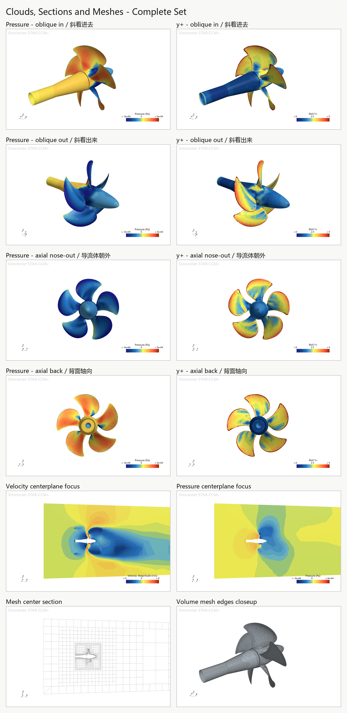

# AutoStar

[English](README.en.md) | 中文

AutoStar 是一个面向 Siemens STAR-CCM+ 螺旋桨开放水 CFD 的对话式工作流。当前初步版本开放 `quick` / `coarse` 两档网格，适合进行 STEP/STP 几何检查、物理方向确认、计算流程验证、400-step pilot 初筛、基础结果解读与云图导出。

> 本项目不包含 STAR-CCM+ 软件本体或 STAR-CCM+ 授权。使用者需要具备可正常运行且获得合法授权的 Siemens STAR-CCM+ 环境。

## 开始使用

- 中文安装指南：[`INSTALL.zh.md`](INSTALL.zh.md)
- Codex 对话测试：[`examples/codex_chat_test.zh.md`](examples/codex_chat_test.zh.md)
- English README：[`README.en.md`](README.en.md)

推荐让 Codex 协助安装。安装前，Codex 应先询问 skill 安装目录、可选的局部 Python 环境目录，以及 CFD 算例输出目录，不应默认修改全局 Python、PATH 或 STAR-CCM+ 安装目录。

```text
请从 https://github.com/Ouscar-ou/AutoStar 安装 AutoStar 初步版本。
安装前先询问我 skill 安装目录、是否创建局部 .venv，以及算例输出目录；
不要修改全局 Python、PATH 或 STAR-CCM+ 安装目录。安装完成后检查环境和 STAR-CCM+ 版本。
```

安装完成后，可在 AutoStar 目录运行：

```powershell
python ./starccm_cli.py integrity-check
python ./starccm_cli.py version
python ./tests/verify_public_preview_package.py
```

`integrity-check` 用于确认安装文件完整，`version` 用于确认 Python 与 STAR-CCM+ 环境。检查通过后，新开一个 Codex 任务或重启 Codex，即可通过对话使用 AutoStar。

## 效果预览

下面是开放水螺旋桨算例的后处理示例，包括压力云图、y+ 云图、中心剖面速度/压力和网格截面。图片用于展示当前版本的报告与后处理形式，不代表正式工程结论。



## 当前能力

当前版本可以帮助用户：

- 检查 STEP/STP 文件、单位、包围盒、轴线与明显几何风险。
- 分别确认螺旋桨轴线、来流方向、入口/出口位置和旋转矢量，降低方向设置错误的风险。
- 检查本机 STAR-CCM+ 环境，并在计算前生成 preflight 结论。
- 使用 `quick` 或 `coarse` 网格完成流程验证和初步 CFD 筛查。
- 在用户确认后运行 400-step pilot，检查残差、推力、扭矩、稳定性和 y+。
- 在用户确认后按目标总步数安全续算，不重复导入、建域或划网格。
- 生成 `preflight_report.md`、`run_report.md` 与 JSON 诊断结果。
- 从已有求解结果导出螺旋桨表面压力/y+ 四视角、中心剖面压力/速度、网格截面和汇总图。

AutoStar 将持续扩展面向工程应用的能力。高密度工程网格、网格无关性评估、批量工况分析、自动化设计迭代，以及更深入的诊断与报告能力，将在完成验证后于后续版本中逐步上线。具体功能与适用范围以各版本发布说明为准。

## 对话式使用

用户不需要先编写完整的 `case.yaml`。提供 STEP/STP 路径和测试目标后，AutoStar 会先检查环境与几何，再用中文逐项询问缺少的信息。遇到方向、尺寸或物理工况不明确时，AutoStar 应先解释并追问，不应自行猜测后直接启动计算。

你可以复制下面这段话开始第一个算例：

```text
使用 AutoStar 检查这个螺旋桨 STEP：
STEP=你的 STEP/STP 文件路径
目标=流程验证/初步筛选

请先检查我的 STAR-CCM+ 环境和几何文件，再用中文逐项询问需要确认的工况、方向、网格和计算资源。
请汇总轴线、来流方向、入口/出口位置和旋转矢量并做闭环检查；未经我确认，不要开始网格或求解。
```

AutoStar 通常会继续确认：

- 螺旋桨真实直径 D 和轴向长度 L。
- 来流速度大小、实际流动方向和入口/出口所在侧。
- 正的转速大小，以及按右手定则定义的旋转矢量方向。
- 水的密度、黏度和湍流模型。
- `quick` 或 `coarse` 网格、400-step pilot 和并行核数。
- 算例目录、输出目录和本次执行授权。

如果某个参数暂时不知道，可以直接回答“不确定，请先根据 STEP 粗估并标出风险”。AutoStar 会把估算值和用户确认值区分开，不会把包围盒尺寸直接当作最终物理真值。

## 用户会得到什么

一次标准的初步测试通常包括：

1. 环境与 STAR-CCM+ 版本检查。
2. STEP/STP 几何和方向风险说明。
3. 用户确认后的工况摘要与 preflight 报告。
4. 网格生成状态和 400-step pilot 结果。
5. 残差、推力、扭矩、稳定性与 y+ 的中文解释。
6. 可用性等级、已知风险和下一步建议。
7. 求解成功时的压力、y+、剖面与网格结果图。

每次运行结束后，AutoStar 会按阶段列出实际生成的报告、JSON、仿真文件和后处理图片链接；即使网格、收敛或云图后处理存在问题，也会保留并链接已经生成的诊断文件，同时说明失败阶段和下一步建议。

400-step pilot 主要用于发现方向、网格和明显发散问题。AutoStar 会分别报告“网格已生成”和“网格质量门控”，不会把 `mesh_success=true` 解释为质量通过；存在明显网格风险时优先建议修复。用户确认延长步数后，AutoStar 使用独立续算流程，只运行缺少的求解步数并刷新结果；`--dry-run` 可先给出不写文件、不启动 STAR-CCM+ 的只读计划。

## 方向信息

螺旋桨算例至少需要分别说明以下信息，不能只用一个含糊的 `axis=X` 代替：

- `shaft_axis`：螺旋桨几何主轴，例如 X、Y 或 Z。
- `flow_direction`：水实际流动方向，例如 `-X`。
- `inlet_side` / `outlet_side`：入口和出口位于轴线哪一侧。
- `rotation_vector`：按右手定则定义的角速度矢量方向，例如 `+X`。
- `velocity` / `rpm`：只填写正的速度和转速大小，方向单独表达。

AutoStar 会检查这些信息是否互相一致，并据此安排入口/出口侧的外域、MRF 和局部加密区域。

## 环境要求

- Windows 10/11。
- Python 3.10+。
- 本机已安装并可正常启动的 Siemens STAR-CCM+。
- 使用者自行提供有效的 Siemens STAR-CCM+ 授权。
- STEP/STP 螺旋桨几何文件和可确认的物理工况。

当前已验证环境为 Windows、Python 3.13 与 STAR-CCM+ `18.04.008-R8`。建议从 STAR-CCM+ `18.04+` 同系列或更新版本开始测试；不同大版本可能存在 Java API、场函数名称或场景导出差异，首次使用应先运行 `version` 检查。

## 本地扩展

为便于升级和问题定位，请不要直接修改或替换 AutoStar 安装包中的官方程序文件。自定义内容请按用途放入：

- `extensions/`：独立脚本、适配器和外部工具集成。
- `workflows/`：自定义工作流说明与流程定义。
- `templates/local/`：本地 case、输入和报告模板。

升级前请备份这三个目录，安装新版后再将自定义内容恢复到对应位置。功能建议、兼容问题和可复现错误可通过 GitHub Issues 反馈。

## 使用说明

当前 `quick` / `coarse` 结果适合流程验证、教学演示和初步筛查，不建议直接作为正式工程认证、船级社认可或论文最终结论。使用者应结合网格密度、收敛性、物理模型和试验数据自行判断结果适用性。

完整授权条款见 [`LICENSE`](LICENSE) 和 [`LICENSE.md`](LICENSE.md)。

STAR-CCM+ 是 Siemens 的商业软件和产品名称。AutoStar 不是 Siemens 官方产品，不包含 STAR-CCM+ 软件或授权，也不替代 Siemens 的许可要求。

## 反馈

普通问题可通过 [GitHub Issues](https://github.com/Ouscar-ou/AutoStar/issues) 提交。建议附上 STAR-CCM+ 与 Windows 版本、`version` 输出、脱敏后的工况信息、相关报告和关键错误日志。

安全问题请使用 [GitHub Private Vulnerability Reporting](https://github.com/Ouscar-ou/AutoStar/security/advisories/new) 私密提交。
